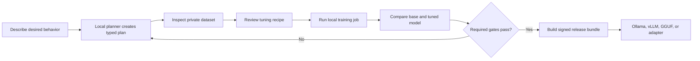

# LocalForge

**Describe the model you need. Review the plan. Tune, evaluate, and package it on your own machine.**

LocalForge is a local-first model workshop for teams that cannot justify sending private data to a hosted model—or paying hosted-model latency and token costs forever. A natural-language goal becomes a typed, reviewable training plan. The same project then carries the dataset audit, fine-tuning recipe, evaluation gates, checkpoint, and release manifest from idea to deployment.

The repository contains two cooperating applications:

- **Studio** — the guided web interface under `app/`.
- **Engine** — the loopback-only Python API and CLI under `src/localforge/`.

The hosted Studio is an interactive product tour. Real datasets and training jobs run only when Studio is opened locally beside the Engine.

## What works

- Turns a natural-language goal into a validated `ModelPlan` using a local Ollama model.
- Falls back to a deterministic offline planner when Ollama is unavailable.
- Inspects local JSONL and CSV data for parse failures, exact duplicates, unknown shape, and likely secrets.
- Generates LoRA, QLoRA, or full-tuning recipes with explicit resource trade-offs.
- Runs TRL `SFTTrainer` jobs in a tracked subprocess with logs and durable SQLite job state.
- Evaluates result files with deterministic exact-match, token-F1, JSON-validity, and latency metrics.
- Packages adapters for Ollama, vLLM, GGUF workflows, or a standard model directory.
- Binds every release to a checksum manifest and optionally includes its evaluation report.
- Provides a complete keyboard-friendly, responsive workflow from definition to deployment.

## Product flow



## Quick start

Prerequisites: Node.js 22+, Python 3.11+, and optionally Ollama plus an NVIDIA GPU for QLoRA.

```powershell
git clone https://github.com/RoUchiha/localforge.git
cd localforge

py -3.11 -m venv .venv
.\.venv\Scripts\Activate.ps1
pip install -e ".[dev]"

npm install
```

Start the private engine in one terminal:

```powershell
localforge doctor
localforge serve
```

Start Studio in another terminal:

```powershell
npm run dev
```

Open the local URL printed by Studio. The UI will use the engine at `http://127.0.0.1:8844`. No account or hosted API key is required.

## Create a plan from natural language

With Ollama installed, set the optional planning model and create a plan:

```powershell
$env:LOCALFORGE_PLANNER_MODEL="qwen2.5:3b"
localforge plan "Build a concise support assistant that follows our private runbooks, never invents policy, and fits in 12 GB VRAM" --vram 12 --output support-plan.json
```

The planner is constrained by the `ModelPlan` JSON schema. The output contains the base-model choice, method, hyperparameters, data shape, promotion gates, warnings, and rationale. If the local planner cannot respond or returns invalid JSON, LocalForge creates a conservative rules-based plan and marks its source accordingly.

## Inspect data before training

TRL accepts conversational, prompt-completion, and standard language-model datasets. LocalForge checks the shape before a costly run begins.

```powershell
localforge inspect .\examples\support-mini.jsonl
```

The inspector never sends file contents over a network. The API upload route writes to the local LocalForge data directory because browser file inputs cannot reveal the original path.

## Run a real local fine-tune

Install the optional training stack:

```powershell
pip install -e ".[train]"
```

Start with the included 12 GB QLoRA preset:

```powershell
localforge run .\presets\qwen-3b-12gb.json .\examples\support-mini.jsonl .\runs\support-v1 --confirm
```

The sample dataset is intentionally tiny and exists to verify the pipeline, not to produce a useful support model. A meaningful adapter needs representative training examples, a locked holdout set, failure cases, and human review.

LocalForge uses the current Hugging Face TRL/PEFT integration: `SFTTrainer`, a `LoraConfig`, and 4-bit `BitsAndBytesConfig` for QLoRA. Conversational JSONL rows use the model's chat template automatically.

## Evaluate and package

Evaluation input is JSONL with `prediction`, `reference`, optional `latency_ms`, and optional `expects_json` fields.

```powershell
localforge evaluate .\results\support-v1.jsonl --output .\runs\support-v1\evaluation.json
localforge package .\runs\support-v1\adapter --name support-specialist --version v1 --base-model Qwen/Qwen2.5-3B-Instruct --target ollama --output .\releases --evaluation .\runs\support-v1\evaluation.json
```

An Ollama package contains a `Modelfile`, adapter, evaluation report, and SHA-256 manifest. The adapter must be paired with the exact base-model family it was trained from. vLLM packages include the reviewed `--enable-lora --lora-modules` launch command.

## Engine API

The Engine exposes OpenAPI documentation at `http://127.0.0.1:8844/docs`.

| Method | Endpoint | Purpose |
|---|---|---|
| `GET` | `/health` | Runtime and Ollama readiness |
| `POST` | `/v1/plans` | Natural-language goal to typed plan |
| `POST` | `/v1/datasets/inspect` | Local browser upload and quality report |
| `POST` | `/v1/runs` | Start a confirmed training job |
| `GET` | `/v1/jobs` | List durable local job records |
| `GET` | `/v1/jobs/{id}` | Inspect job status and output path |
| `POST` | `/v1/packages` | Build a versioned release bundle |

## Design principles

1. **Local is the default trust boundary.** The Engine binds to loopback and accepts only known local Studio origins.
2. **Natural language proposes; schemas decide.** Generated plans must pass typed validation before they can become recipes.
3. **Nothing expensive runs implicitly.** Training requires an explicit confirmation and a visible command.
4. **Evaluation is a release gate, not a chart.** Required thresholds belong in the plan and travel with the checkpoint.
5. **Artifacts are reproducible.** Plans, logs, reports, launch commands, and checksums stay beside the adapter.
6. **The base model remains replaceable.** The tuning layer does not hard-code one vendor or model family.

See [Architecture](docs/ARCHITECTURE.md), [Security](docs/SECURITY.md), and [Model workflow](docs/MODEL_WORKFLOW.md) for implementation details.

## Validation

```powershell
npm test
python -m pytest
python -m compileall -q src
```

## Important limits

- LocalForge does not make a weak dataset strong. Dataset quality and correct human review still dominate outcomes.
- Model licenses and dataset rights differ. Confirm both before training or redistribution.
- The built-in evaluator is deterministic by design. Add domain metrics or a reviewed local judge for subjective tasks.
- GGUF conversion depends on the target model architecture and a compatible llama.cpp checkout; LocalForge emits the handoff rather than hiding those steps.
- Full fine-tuning can require multiple high-memory GPUs. The default planner prefers adapters.

## License

Copyright © 2026 RoUchiha. All rights reserved. This repository is source-available for evaluation and portfolio review only; see [LICENSE](LICENSE) and [NOTICE](NOTICE).

