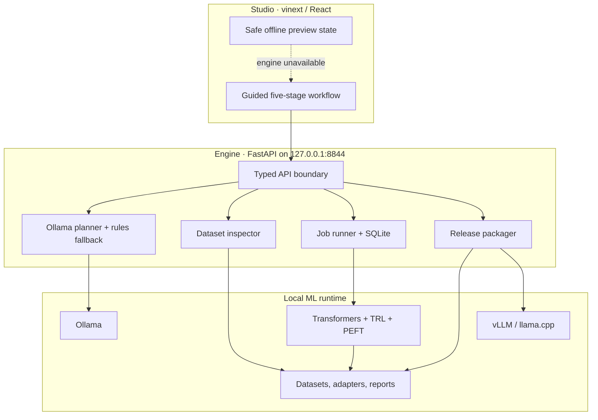

# Architecture

LocalForge separates the user experience from the privileged local runtime.

## Boundaries

- Studio can be hosted because it contains no model weights, data, or credentials.
- Engine is intentionally local and owns filesystem access, subprocesses, job state, and packaging.
- The browser never submits an arbitrary command. It submits a validated plan and explicit input/output paths; the Engine creates a fixed argument vector with `shell=False`.
- Training lives in a separate Python process so GPU libraries cannot destabilize the API process.
- A plan is the single source of truth for training settings and release gates.

## State model

`ModelPlan` is serialized beside every run as `recipe.json`. `JobRecord` is persisted in SQLite and points to the output directory, whose `run.log` is append-only for that job. A release copies the selected adapter and optional evaluation report into a new versioned directory, then writes a SHA-256 manifest after all other files exist.

## Failure behavior

- Ollama unavailable or invalid planner JSON: deterministic typed fallback.
- Bad dataset: inspection report with row-level issue references; training is not started by inspection.
- Missing training extras: the job fails with a direct install instruction in `run.log`.
- Process failure: non-zero exit code and durable `failed` status.
- Existing release directory: packaging stops instead of overwriting a prior release.

